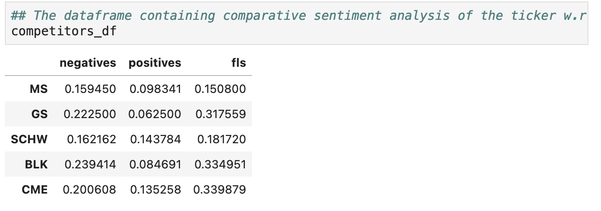
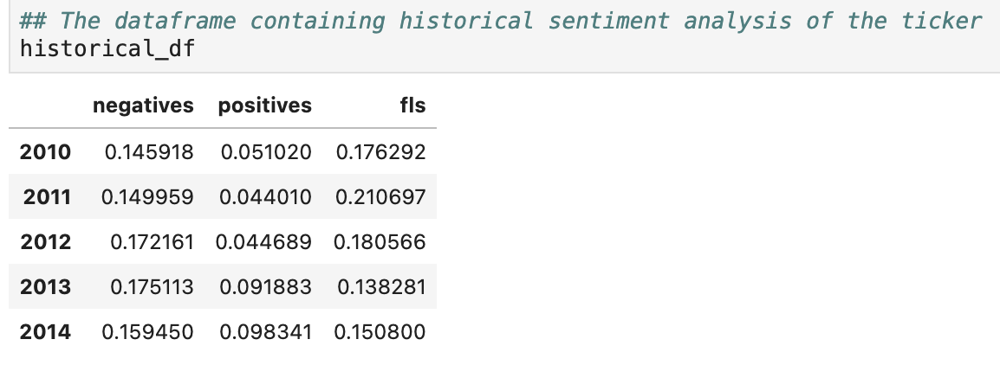
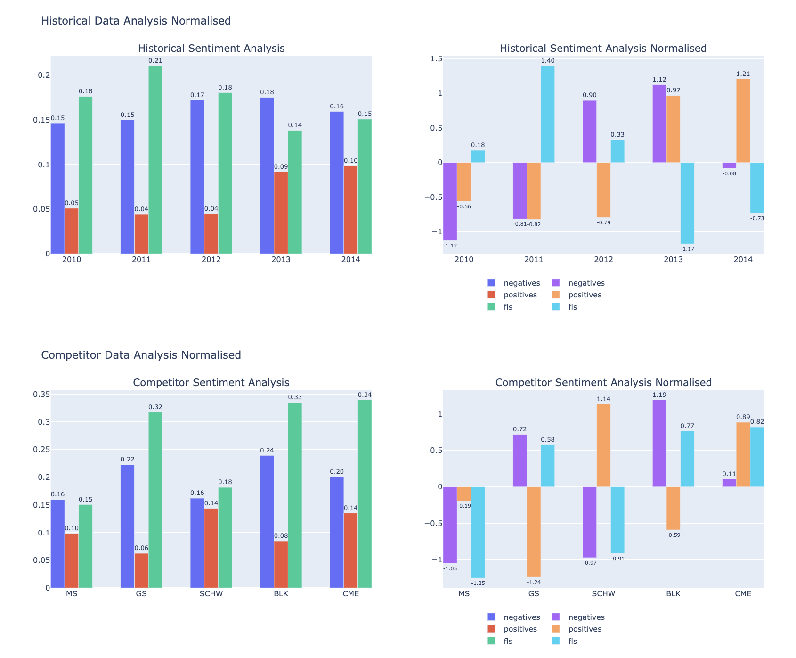
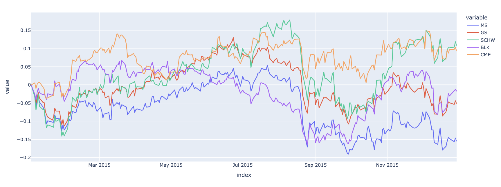

# SEC 10K Report Analysis Using NLP
This project contains directories and files pertaining to the automation of text processing and NLP sentiment analysis of the yearly SEC 10K reports of various tickers as part of my submission for the [GATech FSIL Programming task](FinTech_Lab_Summer_2024_Programming_Task.pdf).

## Installation
To use the project locally, clone the repo. After setting the repo as the current directory, install all the libraries mentioned in the [requirements](requirements.txt) file as follows:

```bash
git clone https://github.com/advaitkumar3107/sec_10k_analysis.git
cd sec_10k_analysis
pip install -r requirements.txt
```

## Usage
The IPython notebook [walkthrough](walkthrough.ipynb) has the step by step guide as well as the explaination for all the code files that have been used in this project. You can run it on your end or take a look at the [walkthrough webpage](walkthrough.html) to get a hang of it.

## Task 1.1
The file [task 1.1](task1_1.py) contains the code for the task. The user can input any ticker, and the python file will download the recent 30 years' worth of SEC 10K reports into the local directory.

## Task 1.2
The file [task 1.2](task_1_2.py) contains all the code for the task. The user can again input the ticker as well as the year for which they want the analysis. The [walkthrough notebook](walkthrough.ipynb) has the analysis done for Morgan Stanley for the year 2014 as an example.
### Discussion
* I have used 2 models for text analysis : 
1) The [FinBert Model](https://huggingface.co/ProsusAI/finbert) which is a BERT model that has been fine-tuned on financial data to provide sentiment analysis (classify a financial statement into positive/negative/neutral sentiment) and
2) The [FinBert FLS](https://huggingface.co/FinanceInc/finbert_fls) model which is also a BERT model that has been fine-tuned on 3,500 manually annotated sentences from Management Discussion and Analysis section of annual reports of Russell 3000 firms. It can classify whether a statement is Forward Looking (Specific or Non-Specific FLS) or not (Non FLS).

&emsp; I felt the need to use both the models as any inference that we draw can be more confidently justified if both the models are in agreement. Since both the models capture independent features, our prediction is more likely to be correct.

* For text pre-processing before feeding into the model, I have used [BeautifulSoup](https://beautiful-soup-4.readthedocs.io/en/latest/) : a very popular xml/html parser to parse the xml files as well as remove any unnecessary data.
* For each input ticker, I calculate it's 4 other competitors in the same industry according to the closest market cap of the competitors. I also download the past 5 years data to make a historical analysis.
* I then use my models to calculate the percentage of positive statements, negative statements and forward looking statements in every report.
* If a report has a higher percentage of positive sentences and a lower percentage of negative sentences, it implies that the company is more optimistic in its future/ or has been performing well in the past. In either cases it would be better to go long on it.
* If a report has higher Forward Looking Statements, it means that the company cares more about its future outlook and growth, hence I have taken it to be a positive indicator.
* I construct another dataframe that has the same data but normalised w.r.t:
  1) The competitors' prediction data 
  2) It's own past 5 years prediction data 
* This helps in a more aesthetic comparision in the plot.
* I generate 2 figures, each having 2 subplots:
  1) The first figure has the historical bar plots for all the 3 percentages for the stock over the past 5 years (both normalised and unnormalised)
  2) The second figure has the comparative bar plots for all the 3 percentages for the stock against its competitors (both normalised and unnormalised)
* I believe that these 4 plots will help in provide a better estimate of the stock's performance as we incorporate both its historical as well as its cross sectional performace.
### Analysis
* I have performed an analysis on Morgan Stanley for the year 2014 in my [walkthrough notebook](walkthrough.ipynb).
* We get the following plots 
* From the above plots we can see that Morgan Stanley didn't perform well with respect to its past 5 years data having only a positive normalised score in positive sentiments and a negative normalised score in forward looking statements with an almost zero score in negative sentiments.
* In comparision with its competitors, it performs pretty badly as it has both a negative normalised positive sentiment score as well as a negative normalised forward looking sentiment score. On the other hand, Chicago Mercentile Exchange or (CME) has both a positive sentiment score as well as a positive FLS score. Hence we can go long on CME and short on MS
* I have plotted the returns of all the 5 competitors w.r.t its stock price on 1st Jan 2015, for the year 2015 (succeeding the year 2014 for which we did the analysis), to verify our claims. 
* From the above plot we can see that CME has been one of the best performing stocks in the group (alongside SCHW) with almost a 10% annual return, whereas MS has been the worst performing stock in the group with a return of nearly -15%.

## Task 2
* For displaying these plots in an application, I have used [streamlit](https://share.streamlit.io/) which is a free of cost online dashboard builder. I chose this since it supports multiple free dashboards for an indefinite time as opposed to other paid apps like Heroku. 
* My dashboard is present on the following url : [streamlit dashboard](https://sec10kanalysis.streamlit.app/).
* Note : It takes about 10-15 minutes to generate the plots since there is a lot of data to be downloaded, and a lot of predictions to be made. Stay patient!

## References
1) Finbert : [https://www.kaggle.com/code/mexwell/huggingface-finbert-for-sentiment-analysis](https://www.kaggle.com/code/mexwell/huggingface-finbert-for-sentiment-analysis)
2) LLMS Analysis : [https://developers.lseg.com/en/article-catalog/article/using-ai-modeling-to-interpret-10-Q-filings](https://developers.lseg.com/en/article-catalog/article/using-ai-modeling-to-interpret-10-Q-filings)
